# SYSTEM_SNAPSHOT.md — Technical Due Diligence Report

> **Date:** 2026-02-11
> **Application:** Shows Web Application
> **Age:** ~3 years (est. 2023)
> **Author:** Nir Yakov
> **Audit Type:** Pre-Modernization Baseline

---

## Table of Contents

1. [High-Level Architecture Diagram](#1-high-level-architecture-diagram)
2. [Tech Stack & Version Audit](#2-tech-stack--version-audit)
3. [Data Model Schema (Reverse Engineered)](#3-data-model-schema-reverse-engineered)
4. [Feature Logic & "The Happy Paths"](#4-feature-logic--the-happy-paths)
5. [Security Risks](#5-security-risks)
6. [Refactoring Roadmap (Gap Analysis)](#6-refactoring-roadmap-gap-analysis)

---

## 1. High-Level Architecture Diagram


### Request Flow (Authenticated Endpoint)


---

## 2. Tech Stack & Version Audit

### Current Versions

| Layer                     | Technology          | Pinned Version    | Current Latest (2026) | Gap                                                    |
| ------------------------- | ------------------- | ----------------- | --------------------- | ------------------------------------------------------ |
| **Runtime**               | Node.js             | Not specified     | 22.x LTS              | ⚠️ Unknown — no `.nvmrc` or `engines` field            |
| **Frontend Framework**    | Angular             | `^16.0.0`         | 19.x                  | 🔴 3 major versions behind                             |
| **Angular Material**      | `@angular/material` | `^16.0.1`         | 19.x                  | 🔴 3 major versions behind                             |
| **Angular CDK**           | `@angular/cdk`      | `^16.0.1`         | 19.x                  | 🔴 3 major versions behind                             |
| **TypeScript**            | `typescript`        | `~5.0.2`          | 5.7+                  | 🟡 Minor versions behind                               |
| **RxJS**                  | `rxjs`              | `~7.8.0`          | 7.8.x                 | ✅ Current                                             |
| **Zone.js**               | `zone.js`           | `~0.13.0`         | 0.15.x                | 🟡 Behind (needed for zoneless Angular)                |
| **Backend Framework**     | Express             | `^4.18.2`         | 5.x                   | 🟡 Express 5 is now stable                             |
| **ORM**                   | Mongoose            | `^7.1.0`          | 8.x                   | 🟡 1 major version behind                              |
| **Auth**                  | jsonwebtoken        | `^9.0.0`          | 9.x                   | ✅ Current                                             |
| **Hashing**               | bcrypt              | `^5.1.0`          | 5.x                   | ✅ Current                                             |
| **HTTP Client (backend)** | axios               | `^1.4.0`          | 1.7+                  | 🟡 Patch behind                                        |
| **Email**                 | nodemailer          | `^6.9.3`          | 6.x                   | ✅ Current                                             |
| **Test Framework**        | Karma + Jasmine     | `~6.4.0 / ~4.6.0` | —                     | 🔴 Deprecated in Angular 17+ (migrated to Jest/Vitest) |

### Deprecated / Problematic Libraries & Patterns

| Item                                         | Location             | Issue                                                                                                                               |
| -------------------------------------------- | -------------------- | ----------------------------------------------------------------------------------------------------------------------------------- |
| **`body-parser`**                            | `app.js:2`           | Deprecated since Express 4.16. Use `express.json()` and `express.urlencoded()` instead.                                             |
| **`useNewUrlParser` / `useUnifiedTopology`** | `connectDb.js:16-17` | Deprecated and ignored in Mongoose 7+. These options are no-ops.                                                                    |
| **`CanActivate` interface**                  | `auth.guard.ts:10`   | Deprecated in Angular 15.2+. Replaced by functional guards using `CanActivateFn`.                                                   |
| **`HttpClientModule`**                       | `app.module.ts:81`   | Will be replaced by `provideHttpClient()` in standalone API (Angular 15+).                                                          |
| **`entryComponents`**                        | `app.module.ts:95`   | Commented out but present. Removed entirely in Angular 13+.                                                                         |
| **`uniqueValidator: true`**                  | `models/user.js:4,6` | This is NOT a real Mongoose option. Does nothing — unique validation requires `mongoose-unique-validator` plugin or a unique index. |
| **Karma/Jasmine test runner**                | `package.json`       | Karma is deprecated in Angular 17+. Migration to Jest or Web Test Runner recommended.                                               |
| **NgModules pattern**                        | All component files  | Angular 17+ favors standalone components. Full NgModule app will need migration.                                                    |

---

## 3. Data Model Schema (Reverse Engineered)

### 3.1 Users Collection


**Source:** `Shows-Api/models/user.js`

> ⚠️ **Critical Bug:** The schema uses `uniqueValidator: true` which is NOT a valid Mongoose option. There is no actual unique index on `email` or `username`. Uniqueness is only checked programmatically via `findOne()` in the controller, which is subject to race conditions.

### 3.2 Shows Collection


**Source:** `Shows-Api/models/show.js`

**Notes:**

- `creator` is indexed via `ref: "User"` (Mongoose ObjectId reference).
- `type` is a free-form string, no enum validation — should be `movie` or `tv`.
- `apiId` serves as the IMDB identifier. No unique compound index on `(creator, apiId)` — uniqueness is checked programmatically in the controller.
- `rating` is the user's personal rating, not IMDB's.

### 3.3 Friends Collection

```mermaid
erDiagram
    FRIEND_DOC {
        ObjectId _id PK
        ObjectId usernameId FK "ref: User — the owner"
        Array friends "embedded array"
    }

    FRIEND_ENTRY {
        String friendUsername
        ObjectId friendId
    }

    USER ||--o| FRIEND_DOC: "has one friend list"
    FRIEND_DOC ||--o{ FRIEND_ENTRY: "contains"
```



**Source:** `Shows-Api/models/friend.js`

**How the Friends System Works:**

1. **One document per user** — Each user has at most **one** `Friend` document in the collection.
2. **Embedded array pattern** — That document contains a `friends` array of `{ friendUsername, friendId }` objects.
3. **Unidirectional** — Adding a friend is one-way. If User A adds User B, User B does NOT automatically have User A in their friends list.
4. **No remove friend** — There is no endpoint to remove a friend.
5. **No friend request/accept flow** — Friends are added instantly after searching by username.

**Data Flow:**

```
User searches username → GET /api/friends/search/:friendname
  → Backend checks User collection for match
  → Backend checks if already friends (linear scan of array)
  → Returns friendId if found

User adds friend → POST /api/friends/:friendname
  → Backend finds or creates the user's Friend document
  → Pushes { friendUsername, friendId } into the friends array
```

### Relationship Map


---

## 4. Feature Logic & "The Happy Paths"

### 4.1 Compare Shows Feature (Joint / Different / Union)

The compare feature allows a user to compare their show library with a friend's. It is implemented in `controllers/friend.js` using **set-theory operations** comparing shows **by title string**.

#### Compare API Endpoints

| Endpoint                               | Operation                | Logic                                                          |
| -------------------------------------- | ------------------------ | -------------------------------------------------------------- |
| `GET /api/friends/joint/:friendId`     | **Intersection**         | Shows that BOTH users have in their library                    |
| `GET /api/friends/different/:friendId` | **Symmetric Difference** | Shows that are in User A's list OR Friend's list, but NOT both |
| `GET /api/friends/:friendId`           | **Friend's Full List**   | All shows the friend has                                       |
| _(Not implemented)_                    | **Union**                | All unique shows from both users                               |

> Note: `GetUnionShows` exists in the controller code but is **NOT wired to any route**. It is dead code.

#### Joint Shows (Intersection) — Flow

```mermaid
sequenceDiagram
    participant FE as Angular SPA
    participant API as Express Backend
    participant DB as MongoDB

    FE->>API: GET /api/friends/joint/:friendId
    API->>DB: Shows.find({ creator: currentUserId })
    DB-->>API: User's shows[]
    API->>API: Build Map(title → show) for user
    API->>DB: Shows.find({ creator: friendId })
    DB-->>API: Friend's shows[]
    API->>API: Build Map(title → show) for friend
    API->>API: For each friend show: if user Map has same title → push to result
    API-->>FE: { shows: jointShows[] }
```



#### Different Shows (Symmetric Difference) — Flow

Same as above, but collects shows where:

- User has a show that Friend does NOT → added to result
- Friend has a show that User does NOT → added to result

> ⚠️ **Potential Bug:** Comparison is done by exact `title` string match. If two users saved the same show but the title came from different API responses with slight formatting differences, the comparison will fail.

### 4.2 User Library (My Shows) — Status Logic

#### Adding a Show to Library


#### Show Library Operations

| Action          | Endpoint                   | Notes                                        |
| --------------- | -------------------------- | -------------------------------------------- |
| **View All**    | `GET /api/shows/`          | Returns all shows for authenticated user     |
| **View Single** | `GET /api/shows/:apiId`    | Returns specific show by IMDB ID             |
| **Add**         | `POST /api/shows/`         | Checks for duplicate, enriches from IMDB API |
| **Update**      | `PUT /api/shows/:apiId`    | Updates `rating` and `review` only           |
| **Delete**      | `DELETE /api/shows/:apiId` | Removes show from user's library             |

> **Note:** There is NO "Watched"/"To Watch" status field in the schema. The current data model only tracks shows as "in the library" — there is no status differentiation. A status field would need to be **added** to the Show schema to support this feature.

### 4.3 Shows Game Feature

A "Higher or Lower" guessing game using **static data** from a hardcoded 269KB `dataObj.js` file.

| Endpoint                    | Data                                             |
| --------------------------- | ------------------------------------------------ |
| `GET /api/showsgame/tv`     | Returns `dataObj.tv` (static Top 250 TV shows)   |
| `GET /api/showsgame/movies` | Returns `dataObj.movies` (static Top 250 Movies) |

- **No authentication required** — these are public endpoints.
- Data is bundled server-side and never refreshed from IMDB.

### 4.4 Authentication Flow

```mermaid
stateDiagram-v2
    [*] --> NotAuthenticated
    NotAuthenticated --> Signup: User submits email+username+password
    NotAuthenticated --> Login: User submits email+password
    Signup --> NotAuthenticated: Success → redirect to home
    Login --> Authenticated: JWT returned (1hr TTL)
    Authenticated --> NotAuthenticated: Token expires (auto-logout via setTimeout)
    Authenticated --> NotAuthenticated: Manual logout (clear localStorage)
    Authenticated --> ChangePassword: Submit old+new password
    NotAuthenticated --> ForgotPassword: Submit email+username
    ForgotPassword --> NotAuthenticated: New password emailed via Gmail SMTP
```



**Token Storage:** JWT stored in `localStorage` with `token`, `expiration`, `userId`, `username` keys.

---

## 5. Security Risks

> [!CAUTION]
> The following security issues represent **immediate risks** that should be addressed before any production deployment.

### 🔴 CRITICAL

| #   | Issue                                 | Location             | Impact                                                                                                                                                                                                               |
| --- | ------------------------------------- | -------------------- | -------------------------------------------------------------------------------------------------------------------------------------------------------------------------------------------------------------------- |
| 1   | **Hardcoded secrets in source code**  | `config/config.js`   | MongoDB Atlas password, JWT secret key, Gmail app password, and API key are all **committed to Git** in plaintext. Anyone with repo access has full database and email access.                                       |
| 2   | **JWT secret is trivially weak**      | `config/config.js:5` | `JWT_KEY = "secret_this_should_be_longer"` — This is guessable and could allow token forgery.                                                                                                                        |
| 3   | **Console-logging DB credentials**    | `connectDb.js:9`     | `console.log(process.env.ApiKey, process.env.DbString, process.env.DbUser)` — Credentials printed to stdout on every server start.                                                                                   |
| 4   | **Console-logging DB connection URI** | `connectDb.js:13`    | Full MongoDB connection string (including password) printed to stdout.                                                                                                                                               |
| 5   | **Wildcard CORS**                     | `app.js:32`          | `Access-Control-Allow-Origin: *` — Any website can make authenticated requests to the API.                                                                                                                           |
| 6   | **No auth on change-password route**  | `routes/user.js:12`  | The `changepassword` endpoint uses `myTestMiddleware` but not `checkAuth`. However, the controller does verify the old password — the risk is that request body (containing passwords) is logged by test middleware. |

### 🟡 HIGH

| #   | Issue                                             | Location                            | Impact                                                                                                                                                                               |
| --- | ------------------------------------------------- | ----------------------------------- | ------------------------------------------------------------------------------------------------------------------------------------------------------------------------------------ |
| 7   | **Test middleware logs all request bodies**       | `middleware/my-tests-middleware.js` | Every request to user routes logs `params`, `body` (including passwords), `query`, and `headers` to the console.                                                                     |
| 8   | **No rate limiting**                              | All routes                          | No protection against brute-force login attempts or API abuse.                                                                                                                       |
| 9   | **No input sanitization against NoSQL injection** | All controllers                     | Raw `req.body` values are passed directly to Mongoose queries without sanitization.                                                                                                  |
| 10  | **Password logged in change-password**            | `controllers/user.js:138`           | `console.log(password, email, newPassword)` — both old and new passwords logged to console.                                                                                          |
| 11  | **Friend's shows accessible with just friendId**  | `routes/friends.js:18`              | `GET /api/friends/:friendId` returns any user's full show list if you know their ObjectId, even if they haven't added you as a friend.                                               |
| 12  | **AuthGuard intentionally removed**               | `app-routing.module.ts:33`          | Change password and settings routes have comments `// remove the gruard for my testing` and are unguarded.                                                                           |
| 13  | **No HTTPS enforcement**                          | `server.js`                         | Server uses plain `http.createServer()` with no TLS configuration.                                                                                                                   |
| 14  | **Fake unique validation**                        | `models/user.js`                    | `uniqueValidator: true` is not a real Mongoose option — no actual unique constraint exists on email or username at DB level, only programmatic check susceptible to race conditions. |

---

## 6. Refactoring Roadmap (Gap Analysis)

### Top 5 Modernization Tasks

#### Task 1: Security & Secrets Management 🔴 Priority: IMMEDIATE

**What:** Remove all hardcoded credentials, implement proper secrets management.

| Sub-task                                                          | Effort |
| ----------------------------------------------------------------- | ------ |
| Replace `config/config.js` with `.env` file + `dotenv` package    | Small  |
| Add `.env` to `.gitignore` (verify config.js is already ignored)  | Small  |
| Rotate ALL compromised credentials (MongoDB, JWT, Gmail, API key) | Medium |
| Remove all `console.log` statements that expose sensitive data    | Small  |
| Remove `my-tests-middleware.js` from production routes            | Small  |
| Replace wildcard CORS with explicit frontend origin               | Small  |
| Generate a cryptographically strong JWT secret (256+ bits)        | Small  |
| Add rate limiting (`express-rate-limit`)                          | Small  |

**Risk Level:** Low — mostly configuration changes, no logic refactoring needed.

---

#### Task 2: Angular Major Version Upgrade (16 → 19) 🔴 Priority: HIGH

**What:** Upgrade Angular from v16 to the current v19, in incremental steps (16→17→18→19).

| Sub-task                                                               | Effort |
| ---------------------------------------------------------------------- | ------ |
| Migrate `CanActivate` class guard → `CanActivateFn` functional guard   | Small  |
| Replace `HttpClientModule` → `provideHttpClient()`                     | Small  |
| Migrate from NgModules → Standalone Components                         | Large  |
| Replace Karma/Jasmine with Jest or Web Test Runner                     | Medium |
| Update Angular Material to match each Angular version                  | Medium |
| Remove deprecated `BrowserAnimationsModule` duplicate import           | Small  |
| Adopt Angular Signals for reactive state (replaces some RxJS patterns) | Medium |

**Risk Level:** HIGH — Angular 16→17 is the biggest jump (standalone default, new control flow syntax). Each major version upgrade should be done and tested individually.

**High-Risk Areas:**

- `app.module.ts` — Contains all declarations and imports; must be decomposed for standalone
- `AuthInterceptor` — Will need functional interceptor pattern in v17+
- `AuthGuard` — Already deprecated, needs functional guard migration
- Karma test configs — Will be completely replaced

---

#### Task 3: Backend TypeScript Migration 🟡 Priority: HIGH

**What:** Convert the Express backend from JavaScript to TypeScript.

| Sub-task                                                         | Effort |
| ---------------------------------------------------------------- | ------ |
| Initialize `tsconfig.json` for the backend                       | Small  |
| Add TypeScript + `ts-node` / `tsx` to backend `package.json`     | Small  |
| Convert models to TypeScript interfaces + Mongoose typed schemas | Medium |
| Convert controllers with proper request/response typing          | Medium |
| Convert routes with typed middleware chains                      | Small  |
| Convert middleware with proper `Request` extension typing        | Small  |
| Replace `body-parser` with `express.json()`                      | Small  |
| Remove deprecated Mongoose connection options                    | Small  |
| Add proper error handling types                                  | Small  |

**Risk Level:** MEDIUM — The backend is ~35 files. The main risk is:

- `dataObj.js` (269KB static data file) needs careful handling — convert to JSON or typed constant
- Mixed `async/await` and `.then()` chains in controllers — should be standardized during migration
- Error handling is inconsistent (some use `try/catch`, some use `.catch()`)

---

#### Task 4: Data Model & API Fixes 🟡 Priority: MEDIUM

**What:** Fix schema bugs, add missing features, improve API design.

| Sub-task                                                                 | Effort |
| ------------------------------------------------------------------------ | ------ |
| Add proper `unique: true` index on User `email` and `username`           | Small  |
| Add `enum` validation on Show `type` field (`'movie'` / `'tv'`)          | Small  |
| Add compound unique index on Show `(creator, apiId)`                     | Small  |
| Add "status" field to Show schema (`watched` / `to_watch` / `watching`)  | Small  |
| Wire up `GetUnionShows` route (currently dead code)                      | Small  |
| Add "remove friend" endpoint                                             | Medium |
| Make friendship bidirectional (or explicitly document as unidirectional) | Medium |
| Improve show comparison to use `apiId` instead of `title` string match   | Small  |

**Risk Level:** MEDIUM — Schema changes require data migration for existing MongoDB documents.

---

#### Task 5: Developer Experience & Infrastructure 🟢 Priority: MEDIUM

**What:** Add proper tooling, CI/CD, and development standards.

| Sub-task                                                      | Effort |
| ------------------------------------------------------------- | ------ |
| Add `.nvmrc` or `engines` to lock Node.js version             | Small  |
| Add `nodemon` to dev dependencies with proper dev script      | Small  |
| Add ESLint/Prettier configuration (both frontend and backend) | Small  |
| Set up monorepo tooling (Nx or Turborepo) if desired          | Large  |
| Add environment-specific configurations (dev/staging/prod)    | Medium |
| Fill in all empty documentation files in `docs/`              | Medium |
| Add Docker/docker-compose for local development               | Medium |
| Set up CI/CD pipeline (GitHub Actions)                        | Medium |

**Risk Level:** LOW — These are additive changes with no functional risk.

---

### Migration Dependency Order


**Recommended execution order:**

1. **Security fixes** (Task 1) — Do this immediately, independent of everything else
2. **DevEx/Infra** (Task 5) — Set up proper tooling before big migrations
3. **Backend TypeScript** (Task 3) and **Angular Upgrade** (Task 2) — Can be parallelized
4. **Data Model Fixes** (Task 4) — After both frontend and backend are modernized

---

## Appendix: File Inventory

### Backend (`Shows-Api/`)

| File                                | Lines   | Purpose                                          |
| ----------------------------------- | ------- | ------------------------------------------------ |
| `app.js`                            | 67      | Express app setup, middleware, route mounting    |
| `server.js`                         | 53      | HTTP server creation and port binding            |
| `connectDb.js`                      | 26      | MongoDB Atlas connection                         |
| `configToEnv.js`                    | 28      | Loads `config.js` into `process.env`             |
| `config/config.js`                  | 13      | ⚠️ Hardcoded secrets                             |
| `validators.js`                     | 73      | Email, username, password validation             |
| `sendmail.js`                       | 49      | Gmail SMTP password reset                        |
| `makePassword.js`                   | 169     | Random password generator                        |
| `dataObj.js`                        | ~6000+  | Static IMDB Top 250 data (269KB)                 |
| `models/user.js`                    | 9       | User schema                                      |
| `models/show.js`                    | 29      | Show schema                                      |
| `models/friend.js`                  | 21      | Friend list schema                               |
| `controllers/user.js`               | 252     | Auth logic (signup/login/change/forgot password) |
| `controllers/shows.js`              | 301     | Show CRUD + IMDB search                          |
| `controllers/friend.js`             | 346     | Friend management + show comparison              |
| `controllers/showsGame.js`          | 59      | Static game data endpoints                       |
| `controllers/testing.js`            | 281     | Test/debug endpoints                             |
| `middleware/check-auth.js`          | 21      | JWT verification                                 |
| `middleware/my-tests-middleware.js` | 34      | Request logging (⚠️ logs passwords)              |
| `routes/*.js`                       | 5 files | Express route definitions                        |

### Frontend (`Shows-App/show-app-front/src/app/`)

| Module        | Components                                                         | Purpose                             |
| ------------- | ------------------------------------------------------------------ | ----------------------------------- |
| `auth/`       | Login, Signup, ChangePassword, ForgetPassword                      | Authentication UI                   |
| `all-shows/`  | ShowsList, ClipCreate, ClipCard, SingleShowView (×3), ShowListOnly | Show library management             |
| `friends/`    | FriendsList, FriendsSearch, FriendCard, FriendsShowsList           | Friend management & show comparison |
| `shows-game/` | ShowsGameHighlow                                                   | Higher/Lower rating game            |
| `header/`     | HeaderComponent                                                    | Navigation bar                      |
| `settings/`   | SettingsComponent                                                  | User settings page                  |
| `info-page/`  | InfoPageComponent                                                  | Landing/info page                   |
| `error/`      | ErrorComponent                                                     | Material Dialog error popup         |
| `myTest/`     | MyTestComponent                                                    | Development test component          |
