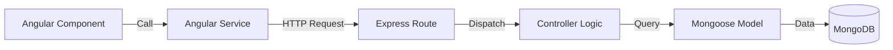

# Developer Guide: Modern TypeScript Architecture 📘

Welcome to the new version of the Shows Web Application! We've migrated from a legacy JavaScript/CommonJS stack to a robust, type-safe TypeScript/ESM architecture.

This guide will help you understand "The Why" and "The How" of our new stack so you can own the code.

---

## 1. Architecture Overview 🏗️

The application follows a standard **MEAN Stack** (MongoDB, Express, Angular, Node) architecture, but strictly typed.

### Data Flow

1.  **Frontend (Angular)**: User clicks a button (e.g., "Add Friend").
2.  **Service Layer**: `friends.service.ts` catches the action and calls the API.
3.  **API Route**: `routes/friends.ts` receives the HTTP request.
4.  **Controller**: `controllers/friends.ts` executes the business logic.
5.  **Database**: Mongoose Models (`models/User.ts`) talk to MongoDB.



---

## 2. Why We Refactored 💡

### 🛡️ TypeScript: Catching Bugs Early

In the old code, we passed `any` objects everywhere. If we renamed `username` to `userId`, the app would crash at runtime.

- **Now**: We use shared **Interfaces** (`src/app/models/`). If you change a field name, the build fails immediately, telling you exactly where to fix it.

### ⏳ Async/Await: No More Callback Hell

Use `async/await` instead of nested `.then().catch()` chains.
**Old Way (Callback Hell):**

```javascript
User.findOne(...)
    .then(user => {
        Show.find(...)
            .then(shows => {
                // Nested mess...
            })
    })
```

**New Way (Linear & Clean):**

```typescript
const user = await User.findOne(...);
const shows = await Show.find(...);
// Linear logic...
```

---

## 3. Code Walkthrough 🗺️

### `src/models/` (The Contract)

This is the single source of truth.

- **Frontend**: `src/app/models/show.model.ts`
- **Backend**: `Shows-Api/models/Show.ts`
- **Rule**: If you change the shape of data, change it here _first_.

### `controllers/` (The Logic)

This is where the brain lives.

- We validate inputs here (using strictly typed Validators).
- We handle success (`200 OK`) and failure (`500 Error`) scenarios explicitly.
- **Rule**: Controllers should never handle HTTP routing details; they just process the request and return a response.

### `routes/` (The Traffic Cop)

Maps URLs (e.g., `/api/shows/`) to specific Controller functions.

- **Rule**: Keep routes simple. No business logic in route files!

---

## 4. Key Learnings & Pitfalls ⚠️

### 👻 The "Identity Crisis" Bug (Stale Identity)

**The Problem**: We used to store the logged-in username in a static variable `myUserName` inside `FriendsService`.
**The Bug**:

1.  User A logs in -> `myUserName = "UserA"`.
2.  User A logs out, User B logs in -> Page doesn't full refresh -> `myUserName` is _still_ "UserA".
3.  User B tries to find themselves and gets "It's you..." error!

**The Fix**:
Always read identity _dynamically_ from `localStorage` when you need it.

```typescript
// BAD: static property
myUserName = localStorage.getItem("username");

// GOOD: dynamic access
searchFriend() {
    const currentUserName = localStorage.getItem("username");
    // ... use currentUserName
}
```

### 🤝 Graceful 200 OK

If a search returns nothing, that's not an error!

- **Old**: Return `400 Bad Request`. (Console turns red ❌)
- **New**: Return `200 OK` with `{ found: false }`. (Console stays green ✅, UI handles the "Not Found" message).

---

## 5. Getting Started 🚀

1.  **Run Backend**: `cd Shows-Api && npm start`
2.  **Run Frontend**: `cd Shows-App/show-app-front && npm start`

Happy Coding!
